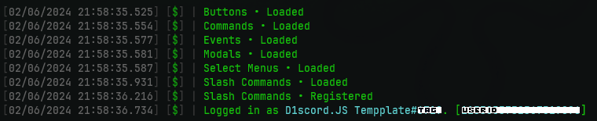

<h1 align="center">
  <br>
  <a href="https://github.com/HimejiDev/Discord.JS-Template"></a>
  <br>
  Discord.JS Template
  <br>
</h1>

<h4 align="center">A simple, yet effective Discord Bot template using <a href="https://discord.js.org/" target="_blank">Discord.JS</a>.</h4>

<p align="center">
  <a href="https://nodejs.org/">
    
  </a>
  <a href="https://discord.js.org/">
    
  </a>
  <a href="https://discord.gg/49rUCrxda9">
    
  </a>
</p>

<p align="center">
  <a href="#key-features">Key Features</a> •
  <a href="#how-to-use">How To Use</a> •
  <a href="#credits">Credits</a> •
  <a href="#license">License</a>
</p>



## Key Features

- Commands Handler
  - aliases, permissions
- Slash Commands Handler
  - options, choices, autocomplete, permissions
- Events Handler
  - ready, messageCreate, interactionCreate, guildCreate, guildDelete
- Button, Modal and Select Menu Handler
  - custom ID, permissions
- Permission Handler
  - commands, slash commands
- Cooldowns (No Database)
- Detailed Logging

## How To Use

To clone and run this application, you'll need [Git](https://git-scm.com) and [Node.js](https://nodejs.org/en/download/) (which comes with [npm](http://npmjs.com)) installed on your computer. From your command line:

```bash
# Clone this repository
$ git clone https://github.com/HimejiDev/Discord.JS-Template

# Go into the repository
$ cd Discord.JS-Template

# Install dependencies
$ npm install
```

Before running the app, you need to create a `.env` file in the root directory and fill it with the following:

```env
TOKEN=
CLIENT_ID=
GUILD_ID=
```

Leave the `GUILD_ID` blank if you want to register slash commands globally.

Once you've done that, you can run the app with the following command:

```bash
$ npm start
```

## Credits

This repository is forked from [Nathaniel-VFX/Discord.js-v14-Command-Handlers](https://github.com/Nathaniel-VFX/Discord.js-v14-Command-Handlers)

This software uses the following open source packages:

- [Node.js](https://nodejs.org/)
- [Discord.JS](https://discord.js.org/)
- [Chalk](https://www.npmjs.com/package/chalk)

## You may also like...

- [Revolt.JS Template](https://github.com/HimejiDev/Revolt.JS-Template) - A simple, yet effective Revolt.JS Bot template.

## License

[MIT](LICENSE)

---

> [himeji.dev](https://www.himeji.dev/) &nbsp;&middot;&nbsp;
> GitHub [@HimejiDev](https://github.com/HimejiDev) &nbsp;&middot;&nbsp;
> Twitter [@H1meji](https://twitter.com/H1m3ji)
